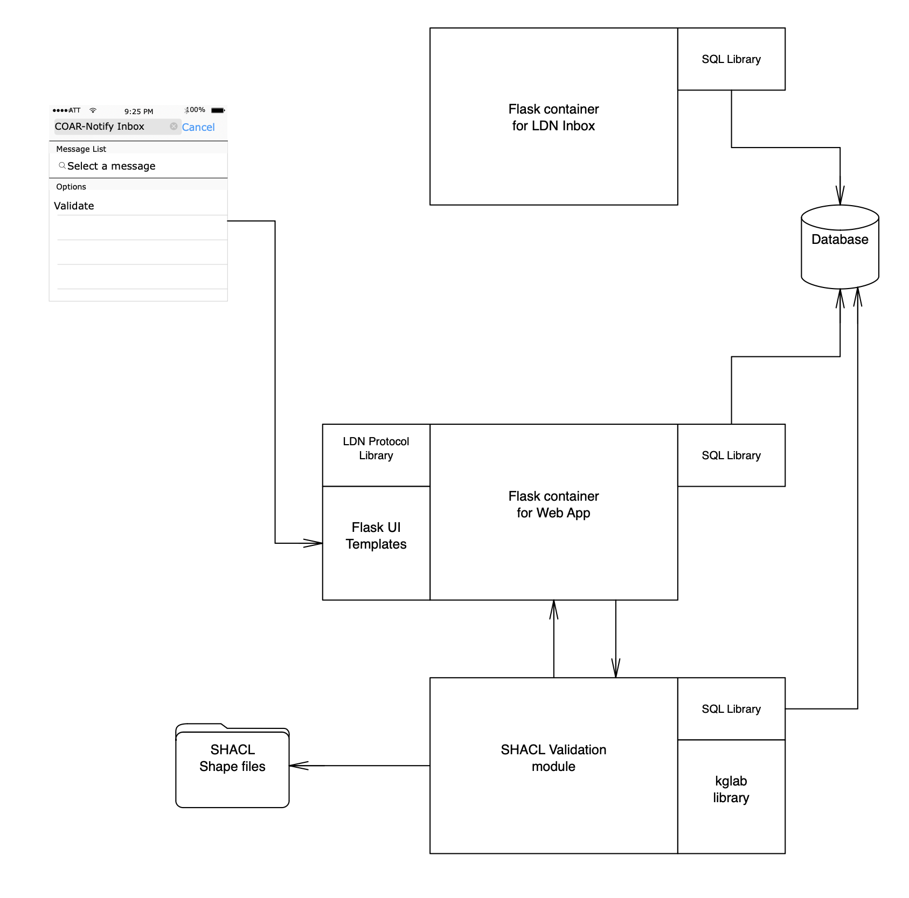
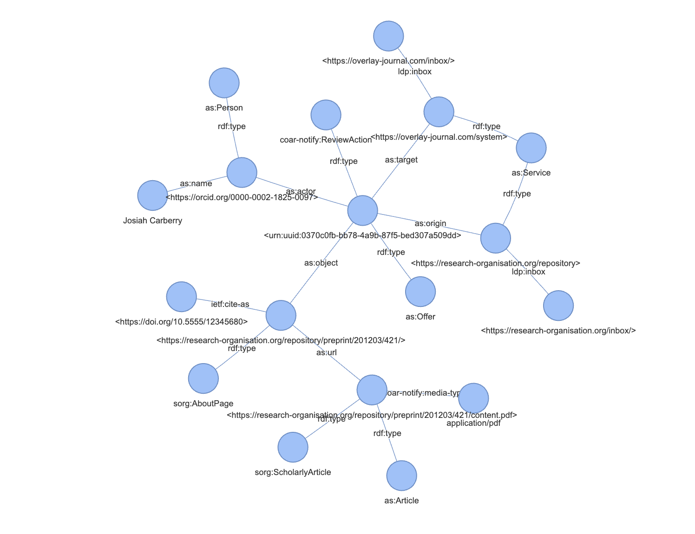
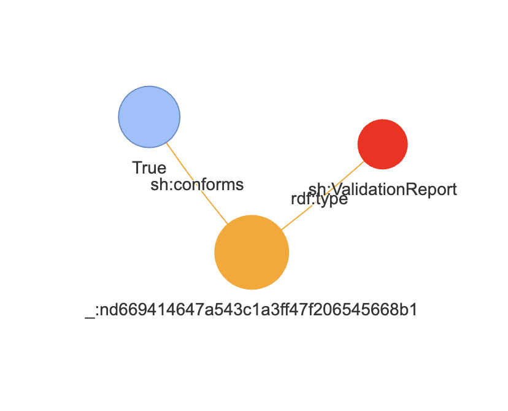

COAR-Notify Validator Inbox

Overview
-----------
This is a tool for validating AS2/COAR-Notify messages that might be exchanged between repositories and various downstream services. Please see [COAR-Notify Protocol documentation](https://notify.coar-repositories.org/) for more information. It supports posting of messages conforming to the defined protocol in various rdf serializations via HTTP POST requests. Once a message is received and stored, the application's Web interface provides the ability for users to validate messages against a SHACL shape validation file. Validation will include diagnostic text if appropriate, and a visualization of the message and validation results.

Install and Run
-----------
<code>
pip install kglab flask

next, edit config.ini if needed.

to run
python validator-inbox.app.py config.ini
</code>

Functional Description
-----------
The Linked Data Notification protocol was designed to enable the exchange of Linked Data between services by way of distributed inboxes. A notification can contain any RDF payload but needs to wrap this payload in such a way that the destination and intent of the sender is conveyed. 

The COAR-Notify inbox service is designed so that it can receive any messages that target it as a recepient provided they reference the COAR-Notify namespace and are AS2 compliant RDF messages that are serialized using one of the serializations supported by the service. Unrecognized serialization, and messages lacking an indication that they at least “may” contain COAR-Notify content are rejected. Since the purpose of the service is to validate these messages, a message merely has to be a well-formed serialization of its self-identified type, that is, a malformed ref-xml or json-ld message will be rejected, but a message that is well-formed xml or JSON-LD but may not be fully compliant with any COAR-Notify message formats will be accepted. It would be possible to generate and return a message containing a shape validation report but this would require that the consumer automatically determine the intended message type, which is beyond the scope of this service. Users should access the web interface of the COAR-Notify inbox in order to trigger a validation request, and review the results of validation. 

An AS2-COAR Notify message is composed 
The message includes an intended recipient
The recipient is queried for its LDN inbox URI via a link header HEAD request
The response to the HEAD request is parsed to identify the ldn inbox address
The AS2-COAR Notify message is sent to the COAR-Notify Validation Service Inbox
If the message meets the accept (MIME type) requirements for RDF message serializations, it is vetted to determine if it contains namespace or context references to the COAR-Notify namespace
Messages that lack COAR-Notify elements will not be stored / accepted

A key component is the COAR-notify inbox which can receive COAR-notify messages in various RDF serializations
The COAR-Notify Validation Service watches for new messages from external senders
As a persistent inbox, it preserves an exact string representation of the message and its header(s)
It records a receipt time stamp and details about the sender
All of this data is inserted into a database table 
The persistent store table includes timestamp, sender, receiver, mime type, message blob
The sender’s LDN inbox is identified via header
A generic AS2 response is sent to the sender

Users can access a Web UI for the persistent inbox store
Message metadata is displayed, sortable by some attributes such as receipt date, sender
A user can select a message to see the original unmodified message received by the inbox
A user can request that a message be validated

The steps of a validation are as follows:
1) the original serialization is retrieved from the database
2) this data is converted into an RDF graph
3) the selected message type shapes file is loaded
4) SHACL validation is performed against the RDF graph of the message
5) any missing elements or malformed elements are identified during shape validation
6) an RDF graph of the validation results is generated 
7) the user is presented with the RDF triples as well as a visualization of the validation report
8) the user is presented with the RDF triples and visualization of the original message

License
-------

This software is distributed under a BSD  license with a "modifications must be indicated" clause. See [the LICENSE file](https://github.com/jepowell-LANL/coar-notify-validator-inbox/blob/d2ec1733d2dc12f60a17aa23db76047fb227b1d7/license.md) for the full text.

Author
------

James Powell, <jepowell@lanl.gov>

-------
© 2024. Triad National Security, LLC. All rights reserved.
This program was produced under U.S. Government contract 89233218CNA000001 for Los Alamos National Laboratory (LANL), which is operated by Triad National Security, LLC for the U.S. Department of Energy/National Nuclear Security Administration. All rights in the program are reserved by Triad National Security, LLC, and the U.S. Department of Energy/National Nuclear Security Administration. The Government is granted for itself and others acting on its behalf a nonexclusive, paid-up, irrevocable worldwide license in this material to reproduce, prepare. derivative works, distribute copies to the public, perform publicly and display publicly, and to permit others to do so.

